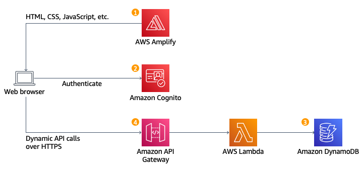
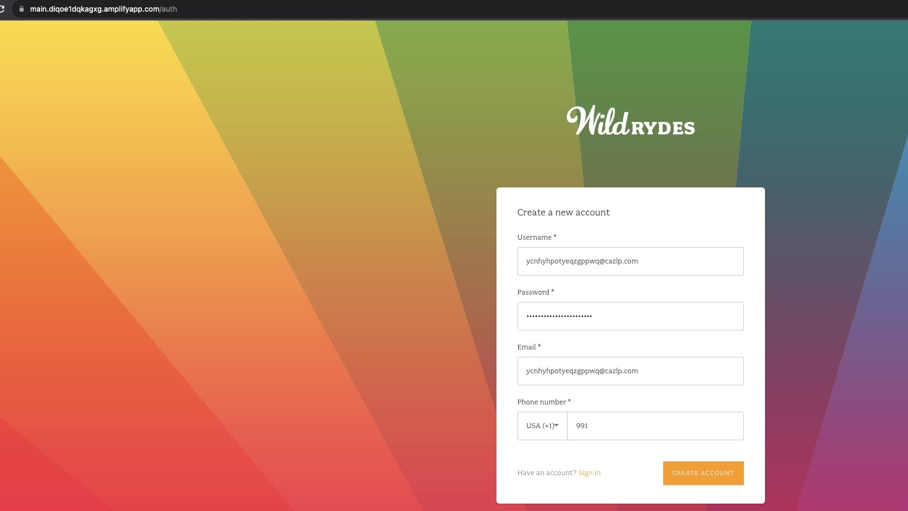
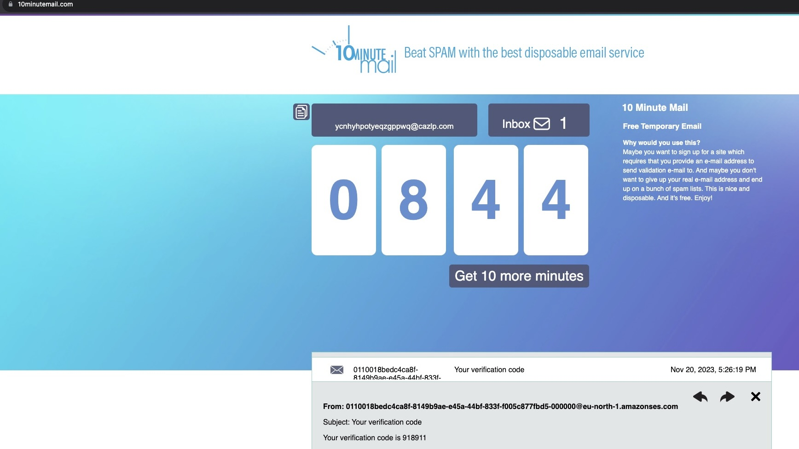
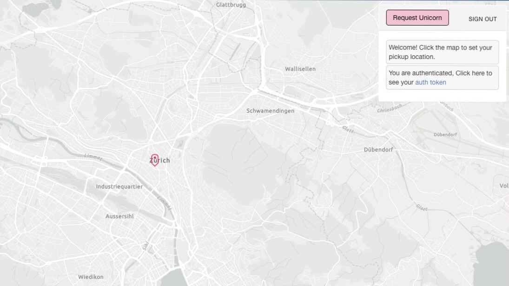
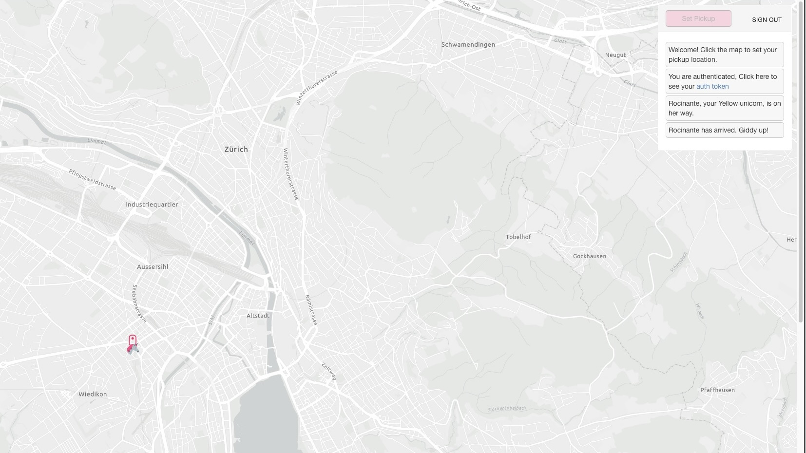

# wildrydes

A rebuild of the serverless website WildRydes Workshop in Vue.js with AWS Amplify CLI.  
Elevating transportation to a magical realm. Summon enchanted unicorns for swift and enchanting journeys. Your commute, reimagined. 🦄✨ Inspired by Uber taxi

## Architecture

## Design

## Registration
 

## Ordering a ride
 

[The website](https://main.diqoe1dqkagxg.amplifyapp.com/)
